# Quizer
Quizer is online quiz  (Multiple choice question) app design and develop as the project for Scripting Language BCA(Bachelor in Computer Application) Fourth Semester. It is Basically the Game Web Application where user need to register to play the Multiple Choice Game. 

### Feature
- Admin panel to control all the operation in app
    - Adding question 
    - Managing users
    - View user feedbacks
    - View the score of the users
- Proper Authentication systems (User Login and Registration)

## Screenshot of the Project
- Home Page
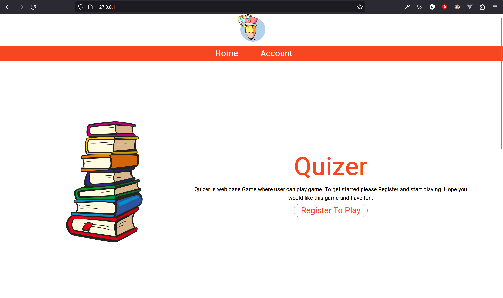
- Login & registration
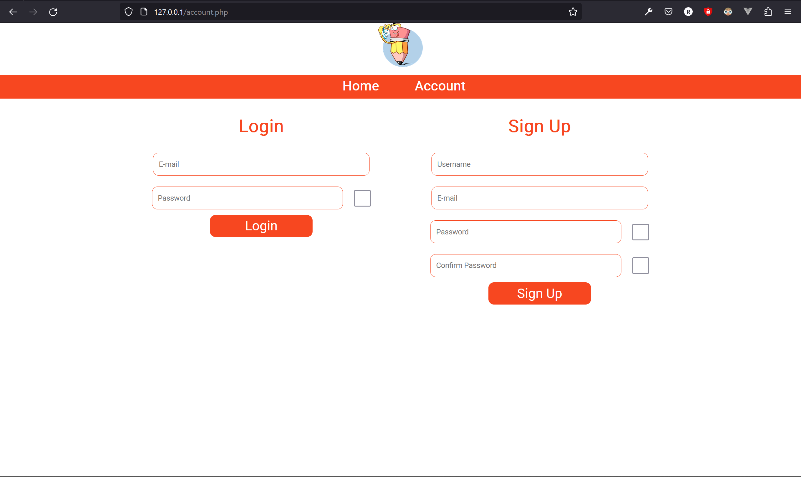
- Profile
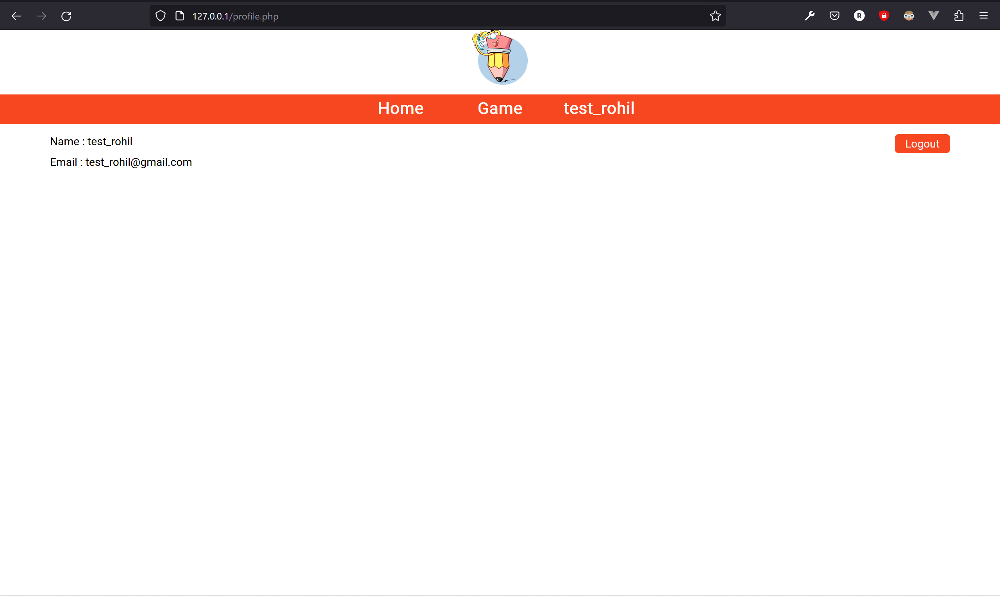
- Profile after playing game
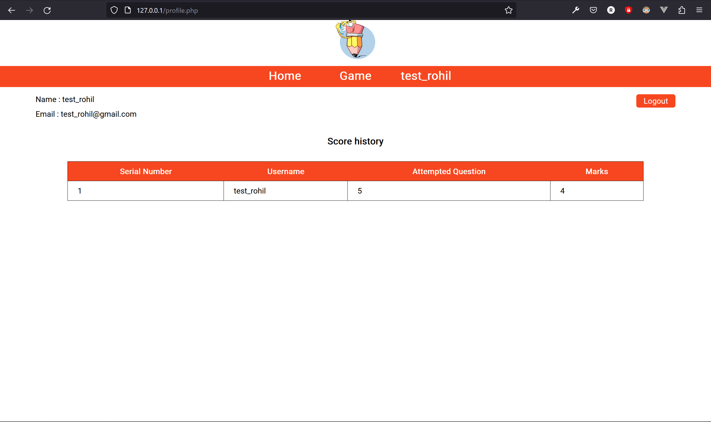
- Game Page
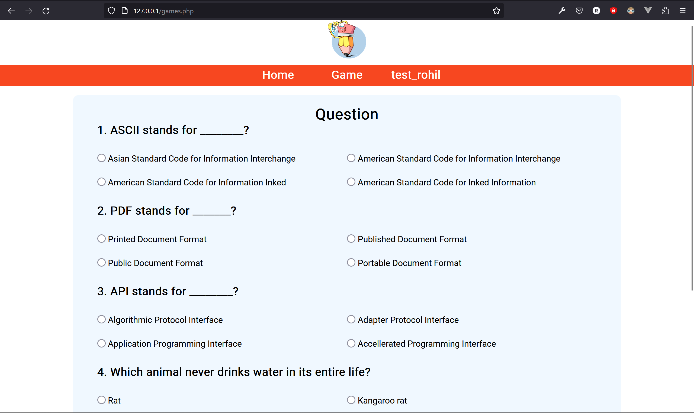
- Result after game
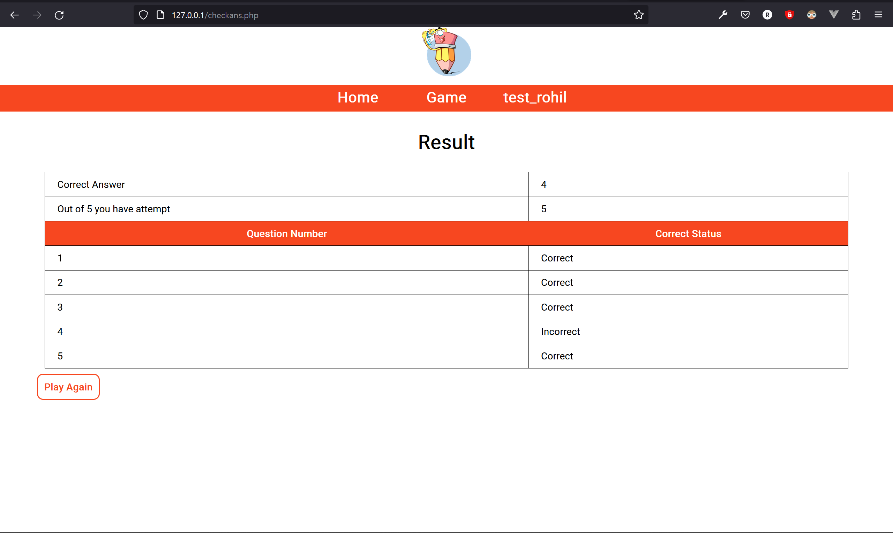
- Feedback
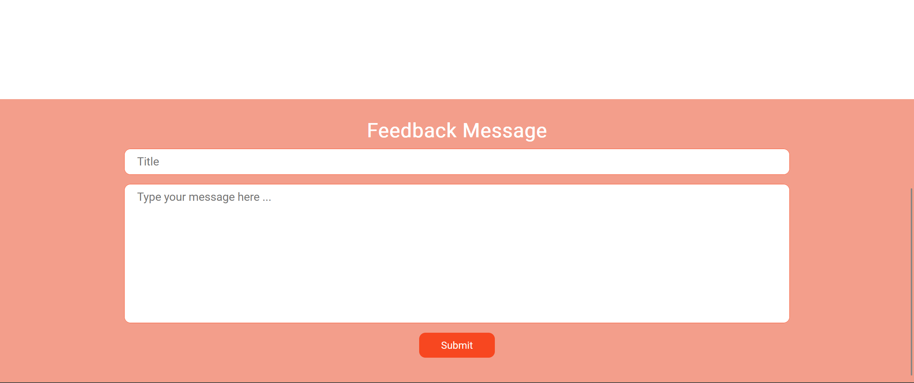
- Admin Dashboard
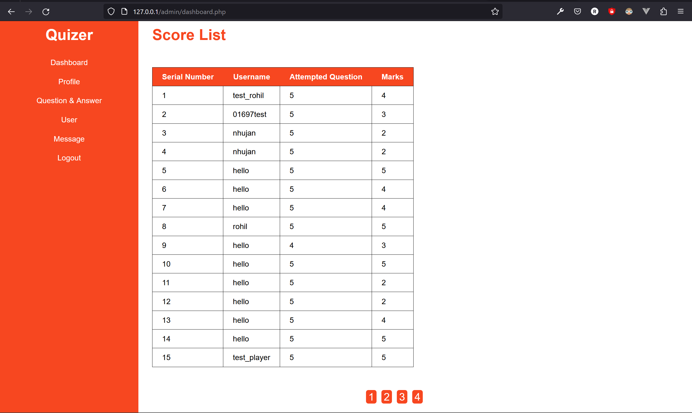
- Question Answer Tab
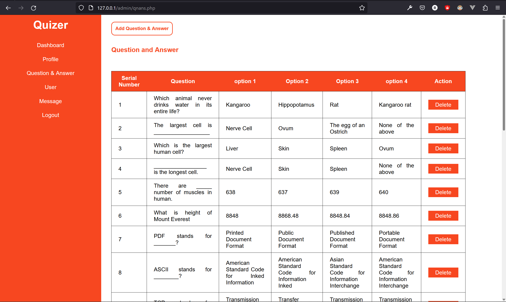
- Add Question
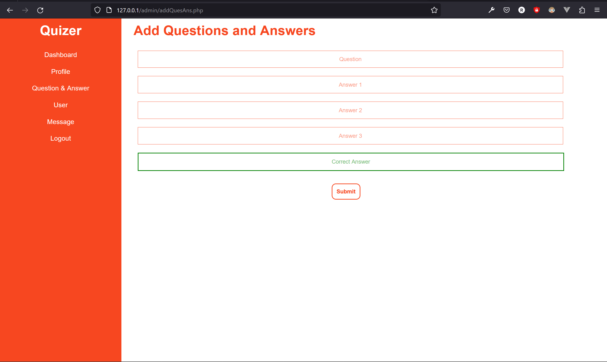
- User List
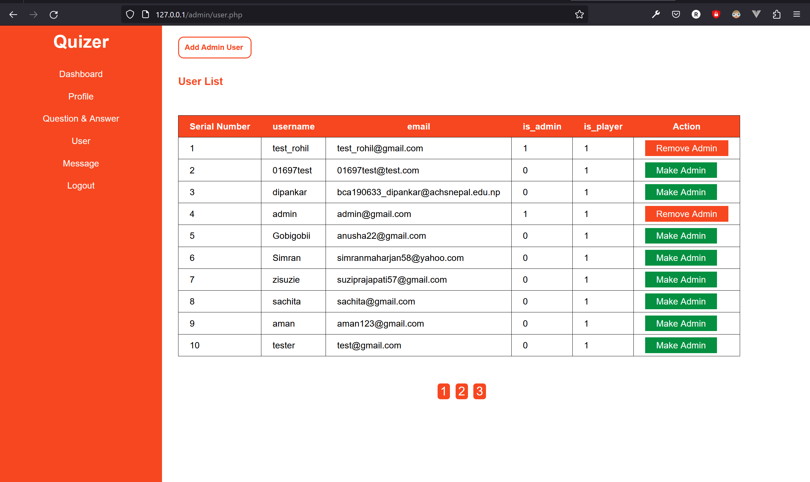
- Message List
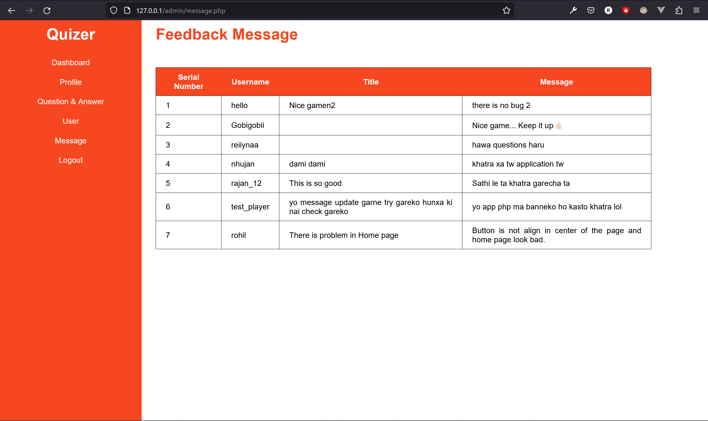
